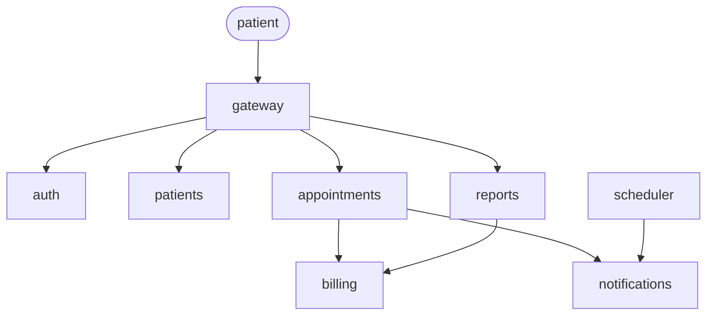

# Synthetic repository — the test bench

A small, fictional clinic booking system. It exists only to measure docs-from-code:
every trap in it is planted on purpose, so the correct answer is always known.

A real project cannot serve this role — nobody knows its correct answers.

**Not production code.** Do not read it as an example of good design: some comments
lie and some names mislead, deliberately.

## One folder = one repository

The spec treats one repository as one unit. Here each top-level folder under
`synthetic/` stands in for a separate repository. The tool reads one folder as the
unit and the other folders as context. Nothing outside a folder belongs to it.

## The system

| Service | Does |
|---|---|
| `gateway` | Single entry point; routes requests to the other services |
| `auth` | Issues and checks access tokens |
| `patients` | Stores patient records |
| `appointments` | Books, moves and cancels visits |
| `billing` | Prices a visit and records payments |
| `notifications` | Sends SMS and email |
| `scheduler` | Background worker; sends reminders before visits |
| `reports` | Daily totals for clinic staff |

## Planted traps

Counts follow the golden dataset in [SPEC.md](../SPEC.md#the-golden-dataset).
Which trap goes into which service is decided service by service and recorded here.

| Kind | Planned | Planted |
|---|---|---|
| Behaviour — prose must lose | 8 | 0 |
| Intent — prose is the right source | 4 | 0 |
| Cross-service | 6 | 0 |
| Insufficient information | 4 | 0 |

## Status

Map only. No service code yet.
